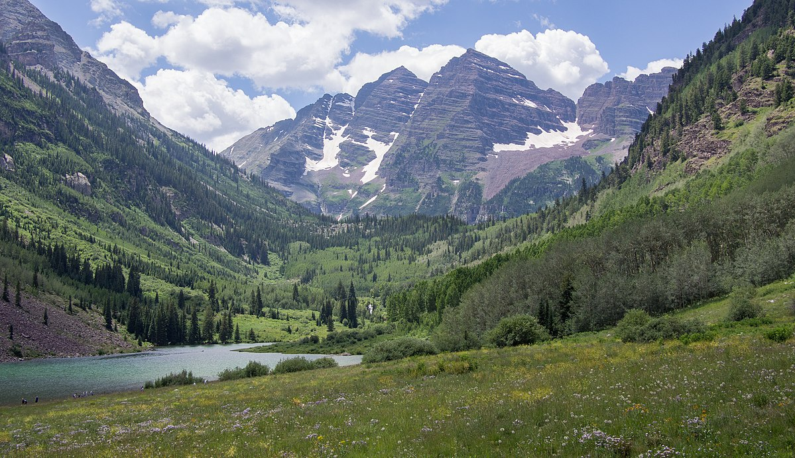

# Not So Random Forest?
By: Clayton Vitek

     

## Background:

**Let's step back in time...**

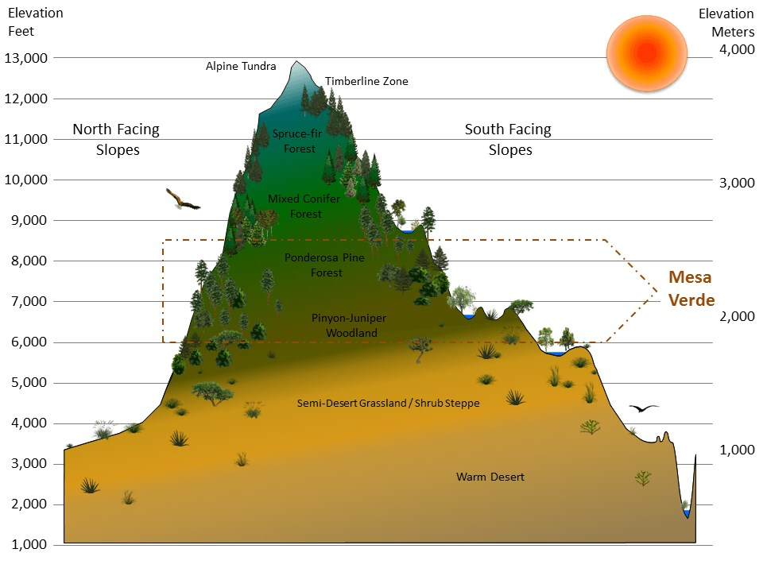

Having grown up in Colorado, in middle school Biology class I learned about **mountain biomes** (or vegitation zones). These were biomes were typically characterized by evalation on a single mountain and they described how certain plants, animals and forests had evolved to live in these zones.

Importantly, each biome was described to have **keystone forest**, which can be thought of as the dominant species in an average, undisturbed portion of the biome.

Question Becomes:  
    *Are the forests of Colorado as discernible as they were described in Biology class???*

  

## The Dataset:

I came across a dataset from the Department of Forest Sciences at Colorado State University, that  described the **forest coverage type** for a 30m x 30m patch of land, and some of the accompanying cartographic and soil taxonomic data for 4 Wilderness Areas in Colorado. 

    Each 30m x 30m patch, were classified as having 1 of 7 forest coverage types:

        1 - Spruce/Fir
        2 - Lodgepole Pine
        3 - Ponderosa Pine
        4 - Cottonwood/Willow
        5 - Aspen
        6 - Douglas-fir
        7 - Krummholz

    

        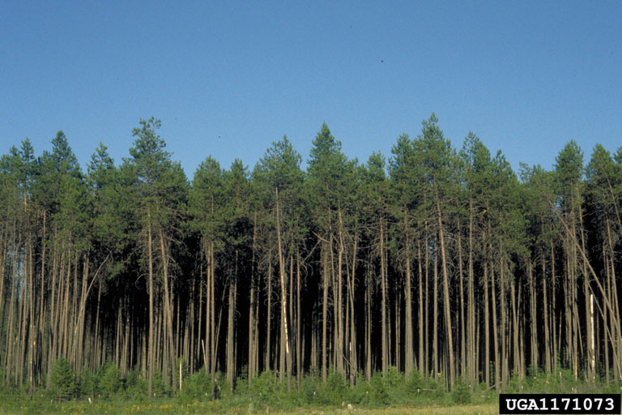
    
  
    

        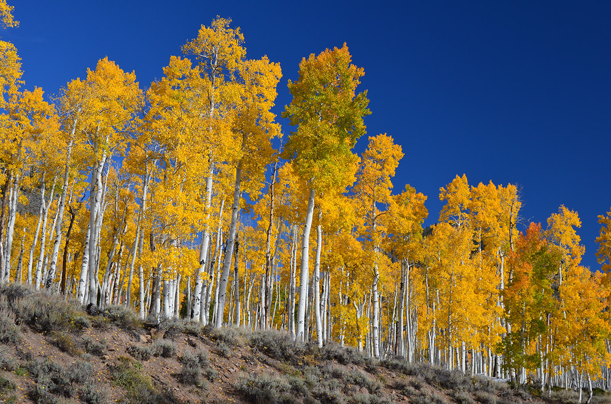
    
  
    

        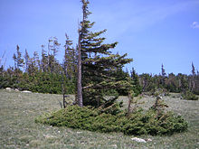
    

    Each observed patch of forest were described to come from 1 of 4 different Wildernes Areas in Roosevelt National Forest:

        1 - Rawah Wilderness Area
        2 - Neota Wilderness Area
        3 - Comanche Peak Wilderness Area
        4 - Cache la Poudre Wilderness Area

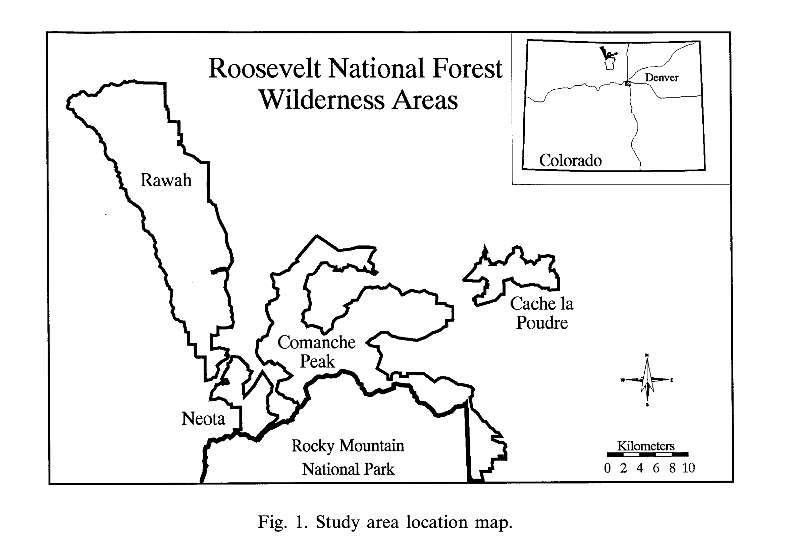
 

After having been studied in research papers in the early 2000s, this dataset also the subject of a Kaggle competition. This dataset contained 565892 patches of forest (observations) and asked the participants to train on a specific subset 15120 of forest *Cover_Type* observations.

Features of the dataset:

    10 x Cartographic (continuous):

        Elevation - Elevation in meters
        Aspect - Aspect in degrees azimuth
        Slope - Slope in degrees
        Horizontal_Distance_To_Hydrology - Horz Dist to nearest surface water features
        Vertical_Distance_To_Hydrology - Vert Dist to nearest surface water features
        Horizontal_Distance_To_Roadways - Horz Dist to nearest roadway
        Hillshade_9am (0 to 255 index) - Hillshade index at 9am, summer solstice
        Hillshade_Noon (0 to 255 index) - Hillshade index at noon, summer solstice
        Hillshade_3pm (0 to 255 index) - Hillshade index at 3pm, summer solstice
        Horizontal_Distance_To_Fire_Points - Horz Dist to nearest wildfire ignition points
        Wilderness_Area (4 binary columns, 0 = absence or 1 = presence) - Wilderness area designation
        Soil_Type (40 binary columns, 0 = absence or 1 = presence) - Soil Type designation
        Cover_Type (7 types, integers 1 to 7) - Forest Cover Type designation

    4 x Wilderness Area (discrete, one hot encoded):

        1 - Rawah Wilderness Area
        2 - Neota Wilderness Area
        3 - Comanche Peak Wilderness Area
        4 - Cache la Poudre Wilderness Area

    40 x Soil Types (discrete, one hot encoded):

        1 Cathedral family - Rock outcrop complex, extremely stony.
        2 Vanet - Ratake families complex, very stony.
        3 Haploborolis - Rock outcrop complex, rubbly.
        4 Ratake family - Rock outcrop complex, rubbly.
        5 Vanet family - Rock outcrop complex complex, rubbly.
        6 Vanet - Wetmore families - Rock outcrop complex, stony.
        7 Gothic family.
        8 Supervisor - Limber families complex.
        9 Troutville family, very stony.
        10 Bullwark - Catamount families - Rock outcrop complex, rubbly.
        11 Bullwark - Catamount families - Rock land complex, rubbly.
        12 Legault family - Rock land complex, stony.
        13 Catamount family - Rock land - Bullwark family complex, rubbly.
        14 Pachic Argiborolis - Aquolis complex.
        15 unspecified in the USFS Soil and ELU Survey.
        16 Cryaquolis - Cryoborolis complex.
        17 Gateview family - Cryaquolis complex.
        18 Rogert family, very stony.
        19 Typic Cryaquolis - Borohemists complex.
        20 Typic Cryaquepts - Typic Cryaquolls complex.
        21 Typic Cryaquolls - Leighcan family, till substratum complex.
        22 Leighcan family, till substratum, extremely bouldery.
        23 Leighcan family, till substratum - Typic Cryaquolls complex.
        24 Leighcan family, extremely stony.
        25 Leighcan family, warm, extremely stony.
        26 Granile - Catamount families complex, very stony.
        27 Leighcan family, warm - Rock outcrop complex, extremely stony.
        28 Leighcan family - Rock outcrop complex, extremely stony.
        29 Como - Legault families complex, extremely stony.
        30 Como family - Rock land - Legault family complex, extremely stony.
        31 Leighcan - Catamount families complex, extremely stony.
        32 Catamount family - Rock outcrop - Leighcan family complex, extremely stony.
        33 Leighcan - Catamount families - Rock outcrop complex, extremely stony.
        34 Cryorthents - Rock land complex, extremely stony.
        35 Cryumbrepts - Rock outcrop - Cryaquepts complex.
        36 Bross family - Rock land - Cryumbrepts complex, extremely stony.
        37 Rock outcrop - Cryumbrepts - Cryorthents complex, extremely stony.
        38 Leighcan - Moran families - Cryaquolls complex, extremely stony.
        39 Moran family - Cryorthents - Leighcan family complex, extremely stony.
        40 Moran family - Cryorthents - Rock land complex, extremely stony.

## Exploritory Data Analysis:

### Combined Dataset Analysis:

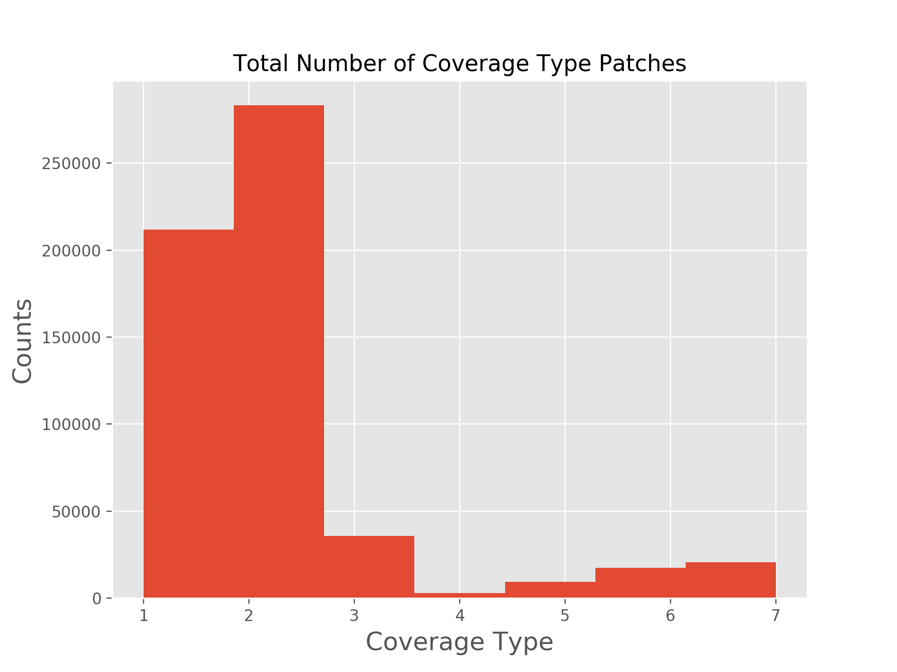

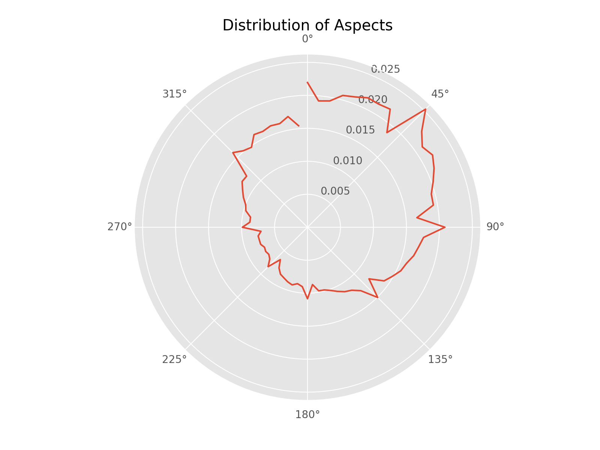

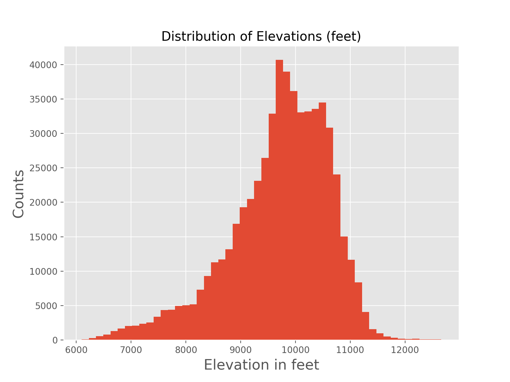

The polar plot above can be interpreted as 0 degs is North, 90 degs is East, etc. I want to pay close attention to this distribution. Does it have any relation to our biomes diagram earlier?

### Training Dataset Analysis:

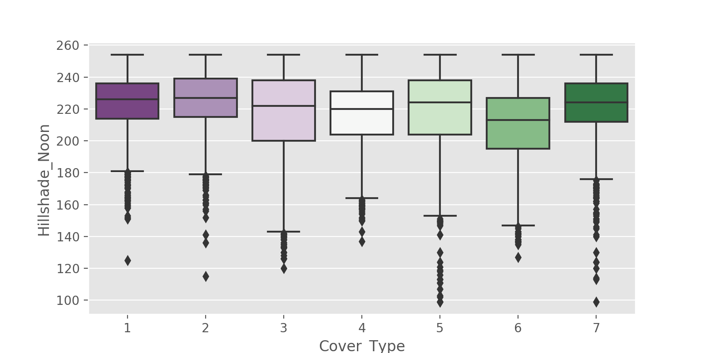

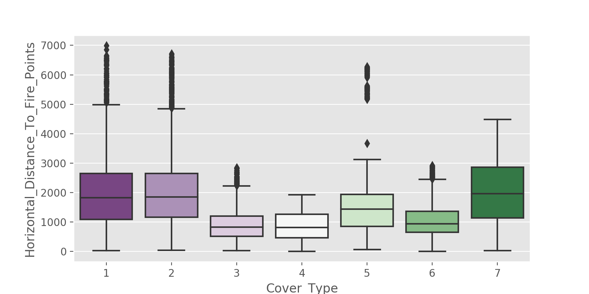

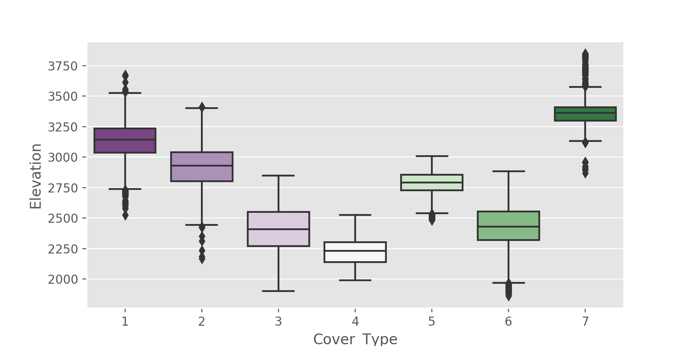

Anecdotally, there are clear clustering for each forest type based on elevation.

## Feature Pruning:

Pruned:
    * Hillshade_3pm
    * Insignificant or unclassified soil types

## Annalysis:

For supervised learning, I tried to use a KNN, Random Forest and Linear Regression. So far have only been effective on KNN.

**KNN Confusion Matrix:**

    [[272  79   0   0  31   0  57]
    [ 88 226  14   0  49  27   7]
    [  0   4 302  50   6  56   0]
    [  0   0   6 421   0  11   0]
    [  0  17  10   0 397   4   0]
    [  0   5  45  29  14 378   0]
    [ 13   4   0   0   0   0 402]]

**KNN Classification Report:**

                    precision    recall  f1-score   support

                 1       0.73      0.62      0.67       439
                 2       0.67      0.55      0.61       411
                 3       0.80      0.72      0.76       418
                 4       0.84      0.96      0.90       438
                 5       0.80      0.93      0.86       428
                 6       0.79      0.80      0.80       471
                 7       0.86      0.96      0.91       419

          accuracy                           0.79      3024
         macro avg       0.79      0.79      0.79      3024
      weighted avg       0.79      0.79      0.79      3024

## Conclusions:

Clearly there is forest clustering in Colorado.

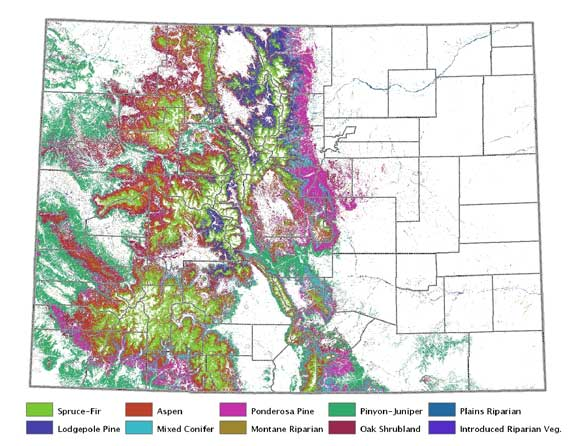

## Next Steps:

* Fix Models
* Tune Features and Models more
